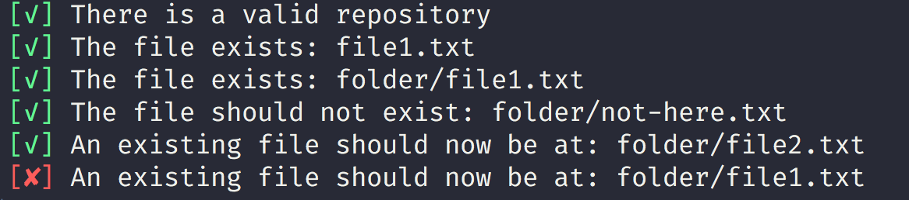

# GitRuler

## Installation and Running

1. Download the jar from Releases
2. Create a file listing the rules to check against a git repository (see below). By default it will look for `gitrules.json` in the repository directory
3. cd into a repository root and run
```bash

java -jar <path-to-jar>

```

You can also specific an alternative repository path or config file using the `-r` and `-c` options:
   
```bash

java -jar <path-to-jar> -c ~/myotherrules.json -r ~/another/repository/.git # (not that the .git is optional)

```   

## Screenshot



## Rules file

The rules that test the repo are in the format of a json array:

```json
[
  { "rule": "head-exists", "stop-on-fail":true},
  { "rule": "file-exists-in-head", "path": "file1.txt"},
  { "rule": "file-exists-in-head", "path": "folder/file1.txt"},
  { "rule": "file-not-exist-in-head", "path": "folder/not-here.txt"},
  { "rule": "blob-exists-in-location-in-head", "path": "folder/file2.txt", "hash": "907b308167f0880fb2a5c0e1614bb0c7620f9dc3"}
]
```

### Rules

- `head-exists`: Checks that a repository with at least one commit exists.
- `file-exists-in-head`: Checks that there is a file at the given `path` in the final commit (head).
- `file-not-exist-in-head`: Checks that there is not a file at a given `path` in the final commit. 
- `blob-exists-in-location-in-head`: Checks that a file with a given `hash` exists at a certain `path` in the last commit. This can be used to test that someone moved a file using git rather than just created a new file with the same name.

### Rules to be created

The following rules are planned to be implemented:

- Checking the number of commits that have been made to a given file.
- Allow checking a file exists or not within a given commit based on commit message.
- Check whether a file was added, modified or deleted within a given commit based on commit message.
- Check whether a branch exists or not.
- Check whether a remote exists or not.

### Common rule instructions

There are some parameters that you can set for all rules.

#### Already Implemented

- `stop-on-fail`: Will stop running rules if this one fails.

#### To Be Implemented

- `success-message`: optional additional message when a rule passes
- `failure-message`: optional additional message when a rule fails
- `alternative-description`: Override the default description of this rule